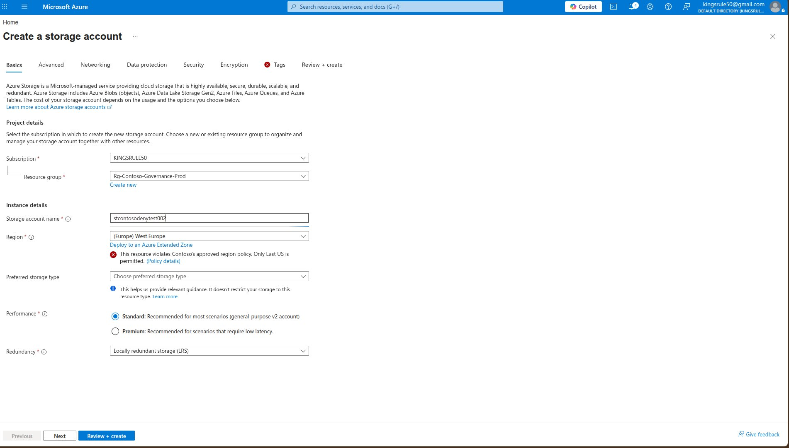
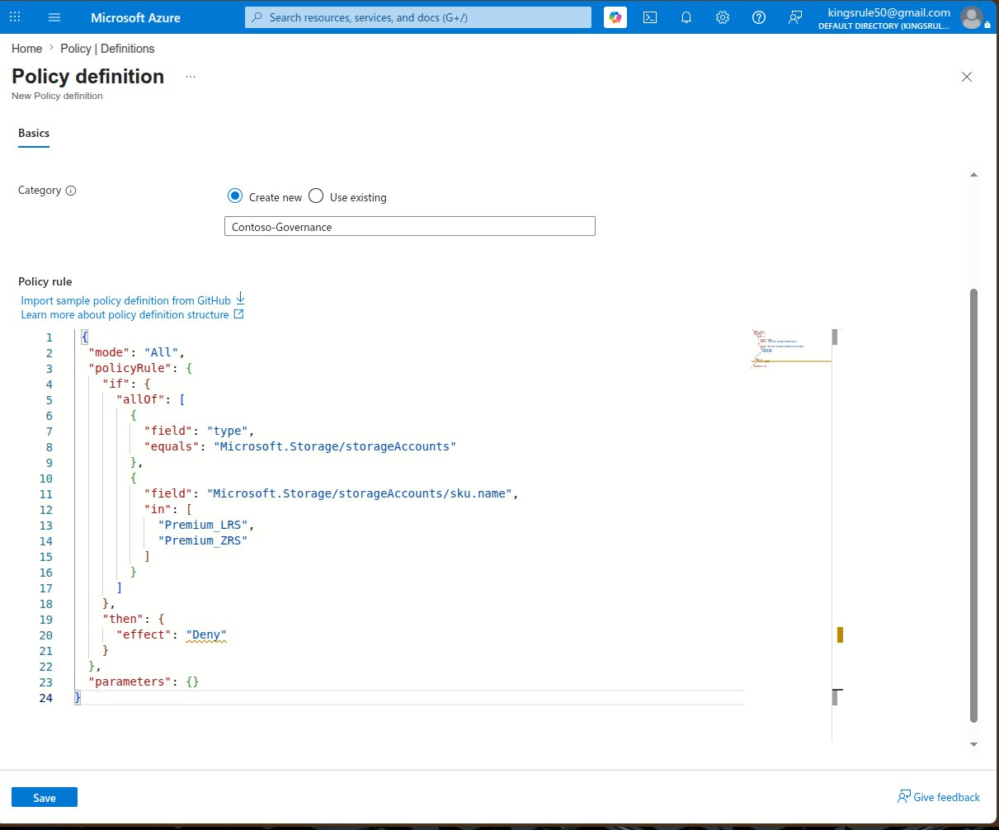
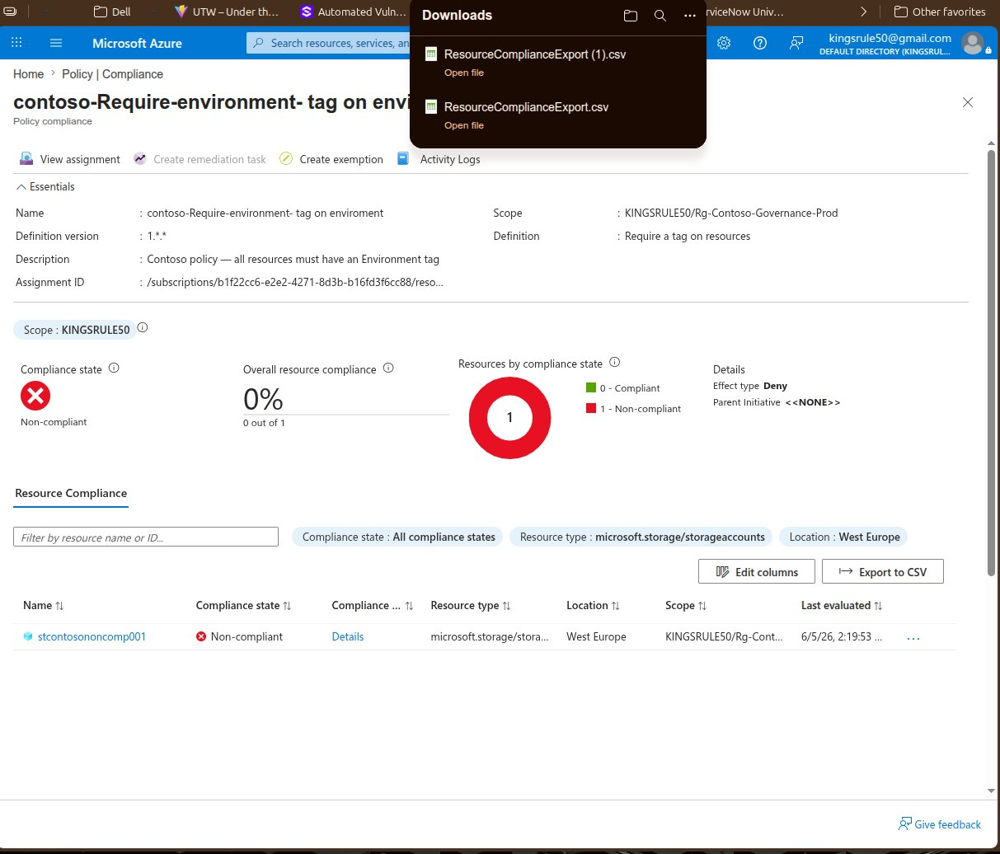

<div align="center">

# 🛡️ Azure Governance with Azure Policy Lab


**I designed and deployed an enterprise Azure governance framework for Contoso Ltd — authoring custom JSON policy definitions, bundling controls into a policy initiative, enforcing live compliance monitoring, implementing least-privilege RBAC, and protecting production resources with deletion locks. Every control was validated with real evidence captured from the Azure Portal.**

[Overview](#-overview) • [Architecture](#-architecture) • [Environment](#-lab-environment) • [Phase Walkthrough](#-phase-walkthrough) • [Skills](#-skills-demonstrated) • [Career Relevance](#-career-relevance)

</div>

---

## 📋 Lab Summary

| Field | Detail |
|---|---|
| **Certification Alignment** | AZ-104 · AZ-500 · SC-100 · SC-300 |
| **Estimated Time** | 3–4 hours |
| **Estimated Cost** | $0 — Microsoft Azure Free Tier / Developer Tenant |
| **Difficulty** | Intermediate |
| **Platform** | Microsoft Azure Portal · Microsoft Entra ID |
| **Career Relevance** | Cloud Security Engineer · Azure Administrator · Governance Analyst · Identity Engineer |

---

## 🎯 Overview

Uncontrolled cloud environments lead to security gaps, cost overruns, and compliance failures. Without enforced governance, teams deploy resources to unapproved regions, skip mandatory tagging, and provision expensive SKUs without authorisation — leaving organisations exposed to audit findings and uncontrolled spend.

In this lab I addressed these gaps by building a complete governance framework for Contoso Ltd using Azure Policy as the enforcement engine:

- **I assigned built-in policies** with Deny effects to block unapproved regions and enforce mandatory resource tagging
- **I authored a custom JSON policy** from scratch to restrict Premium storage SKUs — enforcing Contoso's cost governance standard
- **I created a Policy Initiative** bundling all three controls into a single assignable governance baseline
- **I validated live policy enforcement** — capturing real-time denial evidence directly from the Azure Portal
- **I monitored compliance state** on the Azure Policy dashboard — identifying non-compliant resources and drilling into violation details
- **I implemented least-privilege RBAC** — assigning the Resource Policy Contributor role to a dedicated governance auditor user
- **I applied a resource lock** to the production resource group — preventing accidental deletion regardless of user permissions

> Azure Policy is the primary governance enforcement mechanism in enterprise Microsoft cloud environments. This lab demonstrates the hands-on skills required to design, deploy, and validate policy-driven compliance — directly applicable to Cloud Security Engineer, Azure Administrator, and Governance Analyst roles.

---

## 🏗 Architecture

### Contoso Ltd — Governance Framework

```
┌─────────────────────────────────────────────────────────────────────────────┐
│                          AZURE SUBSCRIPTION (KINGSRULE50)                   │
│                                                                             │
│  ┌───────────────────────────────────────────────────────────────────────┐  │
│  │               RESOURCE GROUP: rg-contoso-governance-prod              │  │
│  │                                                                       │  │
│  │  Tags: Environment=Production | Project=Contoso-Governance            │  │
│  │        Owner=IT-Governance-Team | CostCenter=CC-1001                  │  │
│  │                                                                       │  │
│  │  ┌─────────────────┐    ┌──────────────────┐    ┌──────────────────┐  │  │
│  │  │  Storage Account │    │  Resource Lock   │    │   RBAC Role      │  │  │
│  │  │  stcontosononc.. │    │  contoso-delete- │    │  Policy Auditor  │  │  │
│  │  │  West Europe ❌  │    │  lock (Delete)   │    │  Contoso         │  │  │
│  │  │  No tags ❌      │    │  🔒 Protected    │    │  Resource Policy │  │  │
│  │  └─────────────────┘    └──────────────────┘    │  Contributor     │  │  │
│  │                                                  └──────────────────┘  │  │
│  └───────────────────────────────────────────────────────────────────────┘  │
│                                                                             │
│  ┌───────────────────────────────────────────────────────────────────────┐  │
│  │                        AZURE POLICY ENGINE                            │  │
│  │                                                                       │  │
│  │  ┌─────────────────────────────────────────────────────────────────┐  │  │
│  │  │          INITIATIVE: contoso-governance-baseline                │  │  │
│  │  │                                                                 │  │  │
│  │  │  ┌─────────────────────┐  ┌─────────────────────┐              │  │  │
│  │  │  │  Allowed locations  │  │  Require a tag on   │              │  │  │
│  │  │  │  Effect: Deny       │  │  resources          │              │  │  │
│  │  │  │  Param: East US     │  │  Effect: Deny       │              │  │  │
│  │  │  │  ❌ Non-compliant   │  │  Param: Environment │              │  │  │
│  │  │  └─────────────────────┘  │  ❌ Non-compliant   │              │  │  │
│  │  │                           └─────────────────────┘              │  │  │
│  │  │  ┌─────────────────────────────────────────────────────────┐   │  │  │
│  │  │  │  contoso-restrict-premium-storage (Custom JSON Policy)  │   │  │  │
│  │  │  │  Effect: Deny | Blocks Premium_LRS and Premium_ZRS      │   │  │  │
│  │  │  │  ✅ Compliant — no Premium SKUs deployed                │   │  │  │
│  │  │  └─────────────────────────────────────────────────────────┘   │  │  │
│  │  └─────────────────────────────────────────────────────────────────┘  │  │
│  │                                                                       │  │
│  │  Compliance Dashboard: 0% | 2 Non-compliant resources detected       │  │
│  └───────────────────────────────────────────────────────────────────────┘  │
└─────────────────────────────────────────────────────────────────────────────┘
```

---

## 🖥 Lab Environment

| Component | Detail |
|---|---|
| **Azure Subscription** | Microsoft Azure Developer Tenant (KINGSRULE50) |
| **Resource Group** | rg-contoso-governance-prod — East US |
| **Test Resource** | stcontosononcomp001 — Storage Account (West Europe, no tags) |
| **Policy Engine** | Azure Policy — Assignments, Definitions, Compliance, Remediation |
| **Identity Platform** | Microsoft Entra ID — user creation and RBAC |
| **Governance Scope** | Resource group level (rg-contoso-governance-prod) |
| **Policy Category** | Contoso-Governance (custom category) |
| **Cost** | $0 — Azure Free Tier |

### Enterprise Naming Convention

| Resource | Name |
|---|---|
| Resource Group | `rg-contoso-governance-prod` |
| Test Storage Account | `stcontosononcomp001` |
| Location Policy | `contoso-deny-unapproved-locations` |
| Tag Policy | `contoso-require-environment-tag` |
| Custom Policy | `contoso-restrict-premium-storage` |
| Initiative | `contoso-governance-baseline` |
| Initiative Assignment | `contoso-apply-governance-baseline` |
| RBAC User | `Policy Auditor Contoso` |
| Resource Lock | `contoso-delete-lock` |

---

## 🛠️ Phase Walkthrough

### Phase 1 — Environment Setup

I created the Contoso production resource group in East US, applied all four enterprise tags, then deliberately deployed a non-compliant storage account in West Europe with no tags. This intentional violation would later appear on the compliance dashboard — proving the policies caught a real resource, not a fabricated result.


I confirmed the resource group was tagged correctly with all four Contoso enterprise tags: Environment, Project, Owner, and CostCenter. These same tags would become enforceable standards once the policies were assigned.


I deployed `stcontosononcomp001` in West Europe with no tags intentionally — this resource would be the target that the governance policies flag as non-compliant throughout the lab.


I navigated to the Azure Policy blade and familiarised myself with the Assignments, Definitions, Compliance, and Remediation sections before making any assignments.

---

### Phase 2 — Built-in Policy Assignment

I assigned two enterprise built-in policies to the Contoso production resource group, each configured with a custom non-compliance message that references Contoso by name — ensuring any denial is clearly attributed to organisational policy.

#### Policy 1 — Allowed Locations

I scoped the Allowed Locations policy to `rg-contoso-governance-prod`, selected East US as the only permitted region, and named the assignment `contoso-deny-unapproved-locations`.


I set East US as the sole permitted deployment region. Any resource targeting a different region would be denied at submission time.


I entered a custom non-compliance message so that any denial clearly identifies the Contoso policy by name rather than showing a generic Azure error.


#### Policy 2 — Require Environment Tag

I assigned the Require a Tag on Resources policy, named it `contoso-require-environment-tag`, and set the required tag name to `Environment`.


#### Live Policy Enforcement — Denial Captured

I attempted to create a new storage account in West Europe with no tags. Both policies fired simultaneously — the Azure Portal displayed the custom Contoso denial messages inline before the deployment was even submitted. No deployment failure was needed — the portal blocked it at the form level.



The Basics tab shows the live location policy denial: *"This resource violates Contoso's approved region policy. Only East US is permitted."* — triggered directly by the `contoso-deny-unapproved-locations` assignment.


The Tags tab shows the live tag policy denial: *"This resource is missing the required Environment tag. All Contoso resources must be tagged."* — both policies enforcing simultaneously on the same resource.


The Policy Overview confirmed 2 non-compliant resources detected immediately after assignment — the existing `stcontosononcomp001` storage account was already being evaluated against the new policies.


Both Contoso policy assignments are listed as active, scoped to `rg-contoso-governance-prod`, with Type: Policy confirmed for each.

---

### Phase 3 — Custom Policy Authoring

I authored a custom Azure Policy definition from scratch in JSON — enforcing Contoso's storage cost governance standard by blocking creation of Premium SKU storage accounts. This demonstrates policy schema knowledge beyond what built-in policies can provide.


I named the policy `contoso-restrict-premium-storage`, wrote the description, and created a new custom category called `Contoso-Governance` to clearly separate Contoso-authored policies from Microsoft built-ins in the definitions library.



I wrote the policy rule in the Azure Portal JSON editor. The rule targets `Microsoft.Storage/storageAccounts` and denies any resource where the SKU name is `Premium_LRS` or `Premium_ZRS`.

```json
{
  "mode": "All",
  "policyRule": {
    "if": {
      "allOf": [
        {
          "field": "type",
          "equals": "Microsoft.Storage/storageAccounts"
        },
        {
          "field": "Microsoft.Storage/storageAccounts/sku.name",
          "in": [
            "Premium_LRS",
            "Premium_ZRS"
          ]
        }
      ]
    },
    "then": {
      "effect": "Deny"
    }
  },
  "parameters": {}
}
```


The saved definition confirms **Type: Custom** — this policy was authored by me, not Microsoft. It is categorised under `Contoso-Governance` and has `Available Effects: Deny` confirming the enforcement mode.

I then assigned it to the Contoso production resource group with a custom non-compliance message: *"Premium storage SKUs are not permitted under Contoso cost governance policy."*


---

### Phase 4 — Policy Initiative

I bundled all three governance controls into a single Policy Initiative — `contoso-governance-baseline`. Initiatives are the enterprise pattern for deploying multiple related policies as one assignable object, which is how real organisations manage governance at scale across multiple subscriptions and resource groups.


I created the initiative under the existing `Contoso-Governance` category, keeping all Contoso-authored governance objects grouped together in the definitions library.


I added all three policies to the initiative: the two built-in policies and the custom `contoso-restrict-premium-storage` policy I authored. The initiative now delivers the full Contoso governance baseline in a single assignment.


I set the policy parameters inline within the initiative — East US for the location policy and Environment for the tag policy — so the initiative can be assigned without requiring additional parameter input at assignment time.


The Review + Create page confirms: `contoso-governance-baseline` contains **3 policies**, under the `Contoso-Governance` category.


The saved initiative definition shows all three policies listed with their types — two BuiltIn and one Custom — and all with Deny as the default effect.

I then assigned the initiative to `rg-contoso-governance-prod` as `contoso-apply-governance-baseline`.


The assignment review confirms the custom Contoso non-compliance message: *"This resource does not meet Contoso's baseline governance standards."*

---

### Phase 5 — Compliance Monitoring

With all policies and the initiative assigned, I reviewed the Azure Policy compliance dashboard to validate the governance state of the Contoso production environment and drill into each violation.


The compliance dashboard shows **0% overall resource compliance** — 2 non-compliant resources detected across all Contoso policy assignments. Notably, `contoso-restrict-premium-storage` shows **100% Compliant** because no Premium SKUs were deployed — a passing result is equally valid evidence that the policy is functional.


I drilled into `contoso-apply-governance-baseline` to see the per-policy compliance breakdown. Allowed Locations and Require a Tag are both non-compliant with 1 resource each. The custom premium storage policy is compliant — all three results are expected and accurate.


The Non-compliant resources tab explicitly names `stcontosononcomp001` in West Europe as the violating resource — confirming the governance engine successfully identified the intentionally non-compliant storage account I deployed in Phase 1.


Drilling into the tag policy compliance detail shows `stcontosononcomp001` with compliance state Non-compliant, Effect type: Deny, and a last-evaluated timestamp — proving the policy is actively evaluating resources and not just assigned without enforcement.

I exported the compliance data to CSV as formal evidence of the governance state, which would be used in a real organisation for audit reporting.



---

### Phase 6 — RBAC & Resource Locks

I implemented the identity governance layer — creating a dedicated governance auditor user in Microsoft Entra ID, assigning the least-privilege role at resource group scope, and applying a deletion lock to protect the production environment.

#### Microsoft Entra ID — Governance Auditor User

I created a new internal user `pol.auditor` with the display name Policy Auditor Contoso, representing a dedicated governance role within Contoso Ltd.


I completed the user's job profile — Job title: IT Governance Auditor, Company: Contoso Ltd, Department: IT-Governance — following Contoso's enterprise identity standard for role-based user provisioning.


#### Least-Privilege RBAC Assignment

I assigned the **Resource Policy Contributor** role to Policy Auditor Contoso at the `rg-contoso-governance-prod` scope. This role grants permission to manage Azure Policy assignments without providing Owner or Contributor access to the resources themselves — demonstrating the principle of least privilege.


The Members tab shows Policy Auditor Contoso assigned with a full description confirming the least-privilege intent — scoped specifically to the Contoso production resource group.


The Role Assignments tab confirms the governance access model: **Owner** (Asusu Kingsley — Global Admin) and **Resource Policy Contributor** (Policy Auditor Contoso — least privilege). Two distinct roles, clear separation of duties, scoped correctly at the resource group level.

#### Resource Lock — Production Protection

I applied a Delete lock named `contoso-delete-lock` to `rg-contoso-governance-prod`. This prevents any user — regardless of their RBAC role — from deleting the resource group or its contents without first removing the lock.


The Locks blade confirms `contoso-delete-lock` is active at the resource group scope with Lock type: Delete and the Contoso governance notes recorded.

I validated the lock by attempting to delete the resource group — the operation was blocked immediately.


The deletion attempt returned: *"Delete resource group Rg-Contoso-Governance-Prod failed — The resource group is locked and can't be deleted."* — confirming the lock is actively protecting the production environment.

---

## 🧠 Skills Demonstrated

| Skill | Real-World Application |
|---|---|
| **Azure Policy assignment** | Built-in policy assignment is the primary governance mechanism used by cloud administrators to enforce organisational standards at scale across Azure environments |
| **Custom JSON policy authoring** | Writing policy rules from scratch against the Azure Policy schema — required for enforcing controls that go beyond what Microsoft's built-in policy library covers |
| **Policy initiative design** | Bundling related controls into a single initiative mirrors how enterprise teams deploy governance baselines aligned to regulatory frameworks such as CIS, NIST, and ISO 27001 |
| **Live policy enforcement validation** | Capturing real-time denial evidence from the portal proves the governance controls are functional and enforcing — not just configured and assumed to work |
| **Compliance dashboard analysis** | Interpreting compliant and non-compliant states, drilling into per-resource violations, and exporting compliance data for audit reporting |
| **Least-privilege RBAC design** | Assigning the Resource Policy Contributor role at resource group scope separates governance administration from resource access — a Zero Trust requirement |
| **Resource lock enforcement** | Applying Delete locks at the resource group level protects production environments from accidental or malicious deletion, independent of RBAC permissions |
| **Enterprise tagging strategy** | Consistent tagging across all resources enables cost attribution, resource organisation, and policy-based targeting in production environments |

---

## 🎯 Career Relevance

| Role | How This Lab Applies |
|---|---|
| **Cloud Security Engineer** | Azure Policy is the primary governance enforcement tool in Microsoft cloud security architectures — this lab covers authoring, enforcement, and compliance validation end-to-end |
| **Azure Administrator (AZ-104)** | Policy assignment, compliance monitoring, RBAC implementation, and resource lock management are core AZ-104 exam competencies demonstrated here with real evidence |
| **Azure Security Engineer (AZ-500)** | Custom policy authoring, initiative-based governance, and least-privilege access control are AZ-500 competencies applied to a real production-scoped environment |
| **Governance & Compliance Analyst** | The compliance dashboard, per-policy drill-in, and CSV export workflows replicate the exact toolset used in audit preparation and regulatory compliance reporting |
| **Identity Engineer** | Role-based access control scoped at resource group level and Entra ID user provisioning with job profile attributes are core identity engineering tasks |

---

## 🔐 Security Controls Implemented

| Control | Implementation | Outcome |
|---|---|---|
| **Regional restriction** | `contoso-deny-unapproved-locations` — Deny effect, East US only | Resources outside the approved region are blocked before deployment |
| **Mandatory tagging** | `contoso-require-environment-tag` — Deny effect, Environment tag required | Untagged resources cannot be created — enables cost attribution and policy targeting |
| **SKU cost control** | `contoso-restrict-premium-storage` — Custom JSON policy, Deny effect | Premium_LRS and Premium_ZRS storage SKUs are blocked — prevents unauthorised spend |
| **Governance baseline** | `contoso-governance-baseline` initiative — all 3 controls bundled | Full governance baseline delivered via a single initiative assignment |
| **Compliance visibility** | Azure Policy compliance dashboard with per-resource drill-in | Continuous visibility into governance state — ready for audit reporting |
| **Least-privilege access** | Resource Policy Contributor role scoped to resource group | Policy Auditor Contoso can manage policy assignments without touching resources |
| **Deletion protection** | `contoso-delete-lock` — Delete lock on resource group | Production environment protected from deletion regardless of RBAC permissions |

---

## 📁 Repository Structure

```
azure-governance-policy-lab/
│
├── README.md
├── policies/
│   └── contoso-restrict-premium-storage.json
├── initiatives/
│   └── contoso-governance-baseline.json
├── screenshots/
│   ├── 01-rg-contoso-governance-prod.png
│   ├── 02-noncompliant-storage-account.png
│   ├── 03-azure-policy-overview.png
│   ├── 04-policy-assign-basics.png
│   ├── 05-policy-assign-parameters.png
│   ├── 06-policy-assign-noncompliancemsg.png
│   ├── 07-tag-policy-basics.png
│   ├── 08-tag-policy-parameters.png
│   ├── 09-policy-deny-location-violation.png
│   ├── 09-policy-deny-tag-violation.png
│   ├── 12-policy-overview-noncompliant.png
│   ├── 13-policy-assignments-list.png
│   ├── 14-custom-policy-definition-form.png
│   ├── 15-custom-policy-json-rule.png
│   ├── 15-custom-policy-saved-definition.png
│   ├── 16-custom-policy-assign-basics.png
│   ├── 17-custom-policy-assign-review.png
│   ├── 18-initiative-basics.png
│   ├── 19-initiative-policies-added.png
│   ├── 20-initiative-policy-parameters.png
│   ├── 21-initiative-review-create.png
│   ├── 22-initiative-saved.png
│   ├── 23-initiative-assign-basics.png
│   ├── 24-initiative-assign-review.png
│   ├── 25-compliance-dashboard-overview.png
│   ├── 26-initiative-compliance-policies.png
│   ├── 27-compliance-noncompliant-resources.png
│   ├── 28-compliance-tag-policy-detail.png
│   ├── 29-compliance-export-csv.png
│   ├── 30-entra-user-basics.png
│   ├── 31-entra-user-properties.png
│   ├── 33-rbac-member-assigned.png
│   ├── 35-rbac-role-assignments-list.png
│   ├── 37-resource-lock-applied.png
│   └── 38-resource-lock-delete-blocked.png
└── docs/
    └── compliance-export.csv
```

---

## 🔗 Related Labs

| Lab | Description |
|---|---|
| **[Windows Autopilot & Intune Lab](https://github.com/kingsrule50/windows-autopilot-intune)** | Zero-touch Windows deployment pipeline using Microsoft Intune and Entra ID |
| **[Conditional Access & MFA Lab](https://github.com/kingsrule50/conditional-access-mfa-lab)** | Layered Conditional Access architecture — MFA enforcement and Tor-based risk detection |
| **[Privileged Identity Management Lab](https://github.com/kingsrule50/privileged-identity-management-pim-lab)** | Just-In-Time privileged access control using Microsoft Entra PIM |
| **[Azure SOC Homelab](https://github.com/kingsrule50/azure-soc-homelab)** | Splunk SIEM on Azure — AD log ingestion, SPL detection rules, and automated alerting |

---

## 📚 References

- [Azure Policy Documentation — Microsoft](https://learn.microsoft.com/en-us/azure/governance/policy/)
- [Azure Policy Definition Structure](https://learn.microsoft.com/en-us/azure/governance/policy/concepts/definition-structure)
- [Azure Policy Initiative Definition Structure](https://learn.microsoft.com/en-us/azure/governance/policy/concepts/initiative-definition-structure)
- [Azure RBAC Built-in Roles](https://learn.microsoft.com/en-us/azure/role-based-access-control/built-in-roles)
- [Azure Resource Locks](https://learn.microsoft.com/en-us/azure/azure-resource-manager/management/lock-resources)
- [AZ-104 Azure Administrator Certification](https://learn.microsoft.com/en-us/credentials/certifications/azure-administrator/)
- [AZ-500 Azure Security Engineer Certification](https://learn.microsoft.com/en-us/credentials/certifications/azure-security-engineer/)

---

<div align="center">

**Chinedu Kingsley Asuzu**
Cloud Security Engineer · Microsoft Azure · Governance & Identity

*Part of a hands-on cloud security lab series · Microsoft Azure Developer Tenant · $0 cost*

</div>
